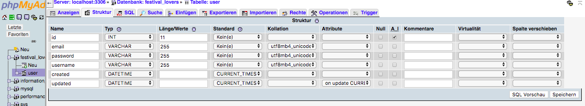
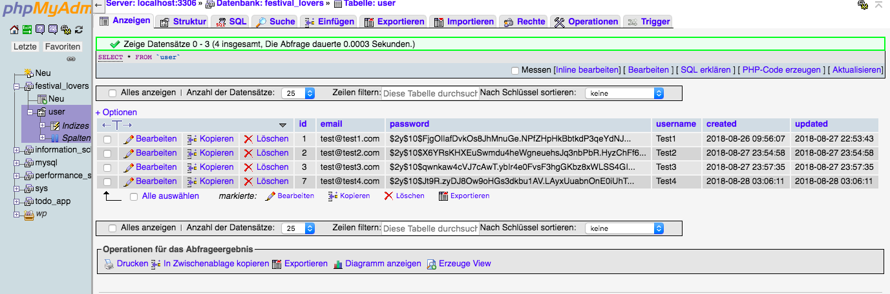
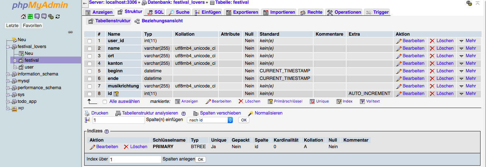

# PHP-Teil  

mysql: kenne nichts anderes, will einfach mal schauen wie weit ich komme    
DB: zeigt auf _localhost_, mir ist klar, dass login und pw mist sind
DB-name: festival_lovers

alle php-files in php Ordner (via ..../dist/php)

Grund: ausprobieren  

1. Testlogin / registrieren:  
a. von DB: Test1 (=username), test@test1.com, test1 (=password)
b. falls registrieren funktioniert: Test2 (=username), test@test2.com, test2 (=password)

2. Wo ist eigentlich der Logout? -> weiter.php und festival.php

3. php files: sind Kopien von den HTML-files  
a. mache nichts kapputt  
b. Übergang html - php nicht klar  

4. wegen css (fehlender korrekter gulptask) via [http://marina.techfabrik.com/app/php/](http://marina.techfabrik.com/app/php/)
Seiten: siehe auf Server oder github
Dementsprechend falsche links in ...kaufen_bestaetigung.php

6. todo's: [https://docs.google.com/spreadsheets/d/1eV_7Tlo0QKG4BIn0B93sUNnICly4tzJ4m1kySTdQwCs/edit?usp=sharing](https://docs.google.com/spreadsheets/d/1eV_7Tlo0QKG4BIn0B93sUNnICly4tzJ4m1kySTdQwCs/edit?usp=sharing)  
(in Tabellenblatt php)

## Installation:  
(https://getcomposer.org/download/)
im Hauptordner Ordner:

php -r "copy('https://getcomposer.org/installer', 'composer-setup.php');"  
php -r "if (hash_file('SHA384', 'composer-setup.php') === '544e09ee996cdf60ece3804abc52599c22b1f40f4323403c44d44fdfdd586475ca9813a858088ffbc1f233e9b180f061') { echo 'Installer verified'; } else { echo 'Installer corrupt'; unlink('composer-setup.php'); } echo PHP_EOL;"  
php composer-setup.php  
php -r "unlink('composer-setup.php');"  

composer require nesbot/carbon  

## Idee:
- allgemeinen user-login  
- wenn der funktioniert: if = admin@admin.com und pw = admin -> Seite
festivals.php, dort Felder für Festival erfassen  
- evtl. später die erfassten Festivals zum Check unten anzeigen, mit button 
löschen bzw. bearbeiten  
- via api festival-daten holen  
- mittels js in html injecten  
- filter festivals (datum, kanton) auf DB / in php diese dann via api an js  
 
## Vorgehen:
Wegen Merge Problem / .gitignore: nochmals im Allgemeinen, in php gelöscht 
und files (vendor) nach draussen verlinkt, Ordner composer.phar gelöscht.  
Da Register und Login (Stand 27.08.2018) zwar funktionierte, jedoch 
irgendwie die Session nicht gelöscht werden konnte, jedesmal DB Passwort 
mitgesendet wurde -> 
alle Dateien in Spick-Ordner, php wird alles neu gemacht.  
   

## Export / Import  
Keine Ahnung

## Literatur  
- login: https://www.php-einfach.de/experte/php-codebeispiele/loginscript/  

## Anhang  
User Tabelle:  
  
Neue Einträge 2-4 via app/php_spick/register.php entstanden, jedoch keine Garantie, dass dies noch geht:  
  
User Tabelle:  
  

  

 [zurück zum Inhaltsverzeichnis](../README.md)    
 [Aufbau](aufbausite.md)  
 [Zusammenfassung & Fazit](dokumentation/zusammenfassung_fazit.md)

