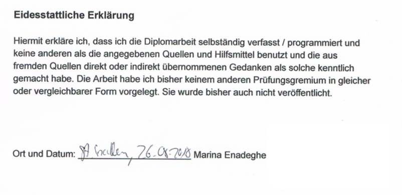

# Zusammenfassung

## Organisation:  
- Aufwand unterschätzt, zum Glück früh angefangen
- Google docs bzw. spreadsheet: sehr praktisch und einfacher als github issues
- typisch ich, Gedanken irgendwo festhalten, dann ordnen
- Zeitplan: erstellt, korrigiert und - da Einzelprojekt - nicht mehr gross beachtet
- gulp: Wollte zu Beginn nicht laufen und habe dann alles noch schlimmer gemacht. Gelernt alles
 Schritt für Schritt zu prüfen und erst dann weiter zu machen (@Alex Karbstein: Danke für 
 die Unterstützung (gulp-task für sass und install.sh) :-))
- package.json: war verwirrend, Grund: githubrepo fehlte noch
- Auf privatem github funktioniert http://htmlpreview.github.io/? nicht (="liveanzeige html"). 
Dadurch lange einfach in Entwicklungsumgebung geprüft.

## eigentliche Umsetzung:  
Jeder Teil jeder Seite ist irgendwie anders. Immer zuerst Mobile und dann die anderen beiden 
Versionen erstellt. Veiths Empfehlung 2 verschiedene Versionen zu machen habe ich 
verworfen, da ich zum einen bereits begonnen hatte, zum anderen ein fluides Design 
wollte (Dickschädel).  
mehr:  
[Aufbau](aufbausite.md) (etwas detailierter wann was wie gemacht)   
[Style Abweichungen](style.md)  

## Dokumentation:  
- laufend Sachen festgehalten (wenn auch recht chaotisch)
- hashtags auf github stören mich, sind jedoch nicht relevant

## Deployment:  
Via Filezilla

## Eidesstattliche Erklärung:  

## php:  
Inhalt Ordner PHP: alles für DB. Für Front-End nicht relevant (höchstens für "minimalnichtmalhalbvollstack").  
[mehr zu php](php.md)

# Fazit  
- Etwas Organisation hilft den Überblick zu bewahren
- Laufend Mobile dann Desktop erstellen macht Sinn, da man sich dann nur 1mal in den Code 
eindenken muss
- Möglichst kein js zu verwenden macht Spass, aber ist zeitaufwändiger in der Lösungsfindung.
- nicht immer einfach den Fokus beizubehalten, wenn man etwas nicht sofort lösen kann
- Literaturverzeichnis: besser laufend erstellen, als im Nachgang zusammensuchen
- Einheitliche paddings & margins von anfang an in einem seperaten scss machen - jetzt 
sehr suchintensiv
- Bugfixen macht Spass wenn man mit etwas anderem gerade nicht weiter kommt.
- Idee via github bei master push auf Server deployen gefällt mir besser als filezilla 
- statt externe links (jquery, normalize) via node_modules einbinden (mehr Kontrolle, aber mehr 
Vorsicht bei Ersetzen von Begriffen geboten)

 [zurück zum Inhaltsverzeichnis](../README.md)  